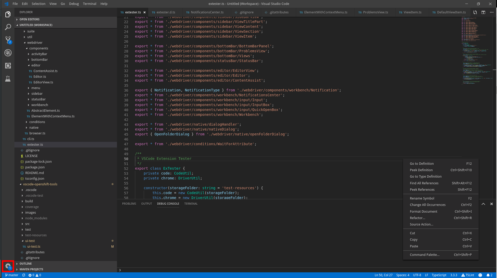

## Look up the ActionsControl by title

Import and find the control through activity bar

```typescript
import { ActivityBar, ActionsControl } from 'vscode-extension-tester';
...
// get actions control for 'Manage'
const control = (await new ActivityBar().getGlobalAction('Manage')) as ActionsControl;
```

## Open action menu

Click the action control to open its context menu

```typescript
const menu = await control.openActionMenu();
```

## Get title

Get the control's title

```typescript
const title = await control.getTitle();
```

## Open context menu

Right click on the control to open the context menu (in this case has the same effect as openActionMenu)

```typescript
const menu = await control.openContextMenu();
```
