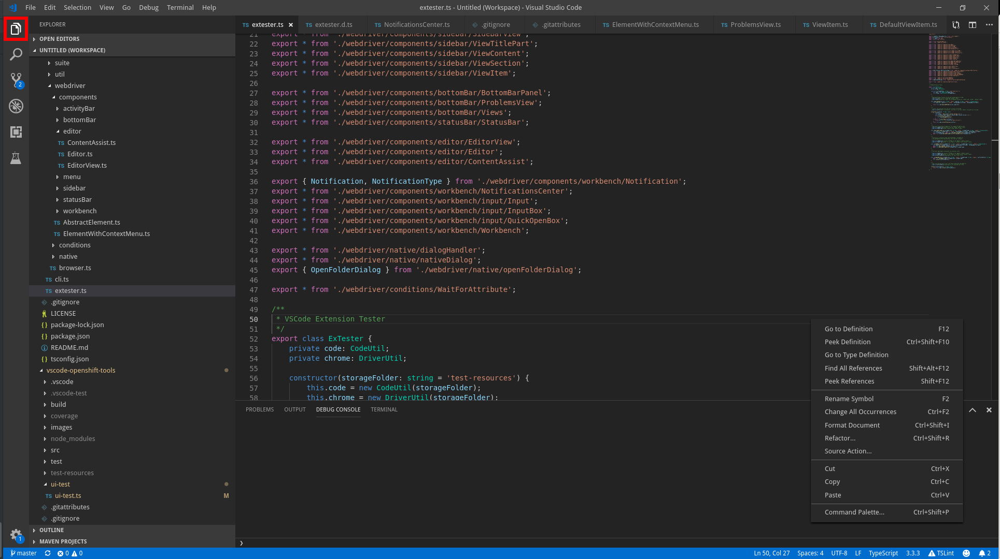

## Look up the ViewControl by title

Import and find the control through activity bar

```typescript
import { ActivityBar, ViewControl } from 'vscode-extension-tester';
...
// get view control for Explorer
const control = (await new ActivityBar().getViewControl('Explorer')) as ViewControl;
```

## Open view

Open the associated view if not already open and get a handler for it

```typescript
const view = await control.openView();
```

## Close view

Close the associated view if open

```typescript
await control.closeView();
```

## Get title

Get the control's/view's title

```typescript
const title = await control.getTitle();
```

## Open context menu

Right click on the control to open the context menu

```typescript
const menu = await control.openContextMenu();
```
