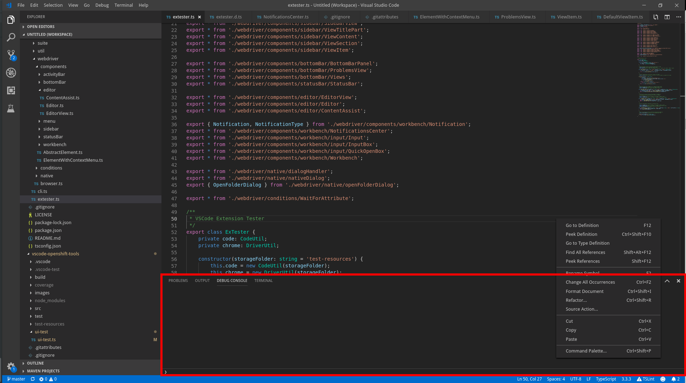

## Lookup

```typescript
import { BottomBarPanel } from 'vscode-extension-tester';
...
const bottomBar = new BottomBarPanel();
```

## Open/Close the panel

```typescript
// open
await bottomBar.toggle(true);
// close
await bottomBar.toggle(false);
// close using the panel's close button
await bottomBar.closePanel();
```

## Maximize/Restore the panel

```typescript
await bottomBar.maximize();
await bottomBar.restore();
```

## Open specific view in the bottom panel

```typescript
const problemsView = await bottomBar.openProblemsView();
const outputView = await bottomBar.openOutputView();
const debugConsoleView = await bottomBar.openDebugConsoleView();
const terminalView = await bottomBar.openTerminalView();
```

## Open custom panel

```typescript
await bottomBar.openTab("name");
```
