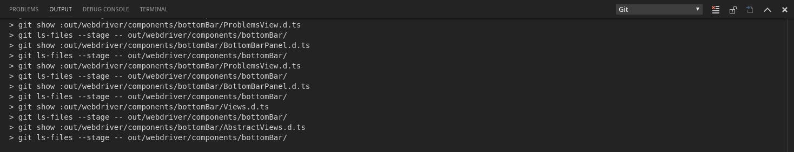

## Lookup

```typescript
import { BottomBarPanel, OutputView } from 'vscode-extension-tester';
...
const outputView = await new BottomBarPanel().openOutputView();
```

## Text Actions

```typescript
// get all text
const text = await outputView.getText();
// clear text
await outputView.clearText();
```

## Channel Selection

```typescript
// get names of all available channels
const names = await outputView.getChannelNames();
// select a channel from the drop box by name
await outputView.selectChannel("Git");
```
