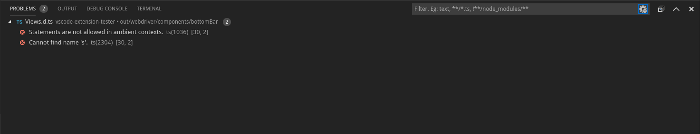

### Lookup

```typescript
import { BottomBarPanel, ProblemsView } from 'vscode-extension-tester';
...
const problemsView = await new BottomBarPanel().openProblemsView();
```

### Set a Filter

Fill in a string into the filter box.

```typescript
await problemsView.setFilter("**/filter/glob*");
```

### Clear the Filter

Clear the filter box.

```typescript
await problemsView.clearFilter();
```

### Get the Count Badge

Get a handle for the badge showing the number of problems.

```typescript
const badge = await problemsView.getCountBadge();
const count = await badge.getText();
```

### Collapse All Markers

```typescript
await problemsView.collapseAll();
```

### Get Handles to All Markers

```typescript
import { MarkerType } from 'vscode-extension-tester';
...
// get all markers regardless of type
const markers = await problemsView.getAllVisibleMarkers(MarkerType.Any);
// get all error markers
const errors = await problemsView.getAllVisibleMarkers(MarkerType.Error);
// get all warning markers
const errors = await problemsView.getAllVisibleMarkers(MarkerType.Warning);
// get all file markers
const errors = await problemsView.getAllVisibleMarkers(MarkerType.File);
```

Note: `getAllMarkers(type)` is a deprecated alias of `getAllVisibleMarkers(type)`, use the latter.

## Marker

Markers represent items displayed in the problems view. Each row corresponds to one Marker item.

### Retrieval

```typescript
const markers = await problemsView.getAllVisibleMarkers(MarkerType.Any);
const marker = markers[0];
```

### Actions

```typescript
// get the marker type
const type = await marker.getType();
// get the text of the marker row
const text = await marker.getText();
// get the label of the marker
const text = await marker.getLabel();
// expand the marker if available
await marker.toggleExpand(true);
// collapse
await marker.toggleExpand(false);
```
