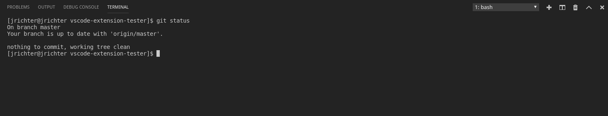

## Lookup

```typescript
import { BottomBarPanel, TerminalView } from 'vscode-extension-tester';
...
const terminalView = await new BottomBarPanel().openTerminalView();
```

## Terminal Selection

```typescript
// get names of all available terminals
const names = await terminalView.getChannelNames();
// select a terminal from the drop box by name
await terminalView.selectChannel("Git");
```

## Execute Commands

```typescript
await terminalView.executeCommand("git status");
```

## Get Text

Select all text and copy it to a variable. No formatting provided.

- This relies on `terminal.integrated.copyOnSelection: true`, which ExTester applies automatically as part of its default settings on every platform. It is only a concern if you override the framework defaults with your own settings file.

```typescript
const text = await terminalView.getText();
```

## Manage Terminals

Create a new terminal or kill the active one.

```typescript
// create a new terminal instance
await terminalView.newTerminal();
// kill the active terminal instance
await terminalView.killTerminal();
```
