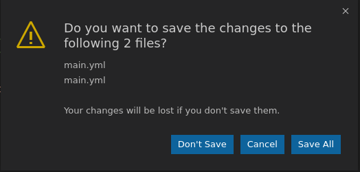

Requires the custom dialog style (`"window.dialogStyle": "custom"`), which ExTester enables by default, so this works out of the box. It is only a concern if you override the framework's default settings.

## Look up

```typescript
const dialog = new ModalDialog();
```

## Get the contents

```typescript
// get the message (the bold text)
const message = await dialog.getMessage();

// get the details (the not so bold text)
const details = await dialog.getDetails();

// get the button web elements
const buttons = await dialog.getButtons();
```

## Push a button

```typescript
// push button with a given title
await dialog.pushButton("Save All");
```

## Close the dialog

Close the dialog using the 'cross' button.

```typescript
await dialog.close();
```
