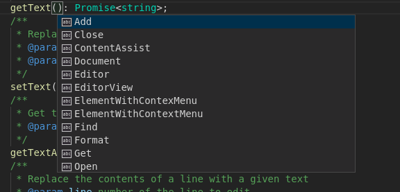

## Open/Lookup

```typescript
import { TextEditor, ContentAssist } from 'vscode-extension-tester';
...
const contentAssist = await new TextEditor().toggleContentAssist(true);
```

## Get Items

```typescript
// find if an item with given label is present
const hasItem = await contentAssist.hasItem("Get");
// get an item by label, returns undefined if not found
// takes an optional timeout in ms (default 30000)
const item = await contentAssist.getItem("Get");
// get all visible items
const items = await contentAssist.getItems();
```

## Select an Item

```typescript
await (await contentAssist.getItem('Get'))?.click();
```
