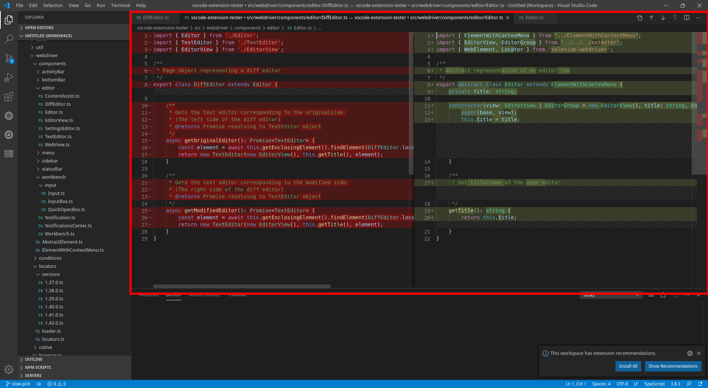

## Lookup

```typescript
// through editors view, cast the result to DiffEditor
const diffEditor1 = (await new EditorView().openEditor("editorTitle")) as DiffEditor;

// directly
const diffEditor2 = new DiffEditor();
```

## Working with the Contents

Since diff editor is basicaly two text editors in one, the `DiffEditor` object gives you the ability to work with two editors:

```typescript
// get the original editor
const original = await diffEditor1.getOriginalEditor();

// get the modified editor
const changed = await diffEditor1.getModifiedEditor();
```
