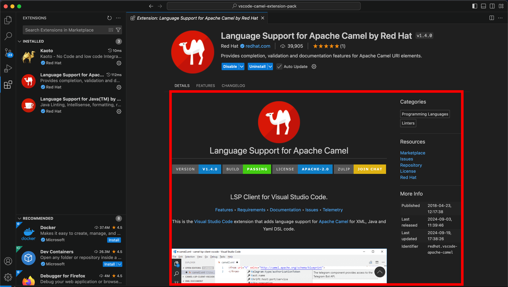

## Lookup

```typescript
import { ExtensionEditorDetailsSection } from 'vscode-extension-tester';
...
const extensionEditorDetails = new ExtensionEditorDetailsSection();
```

You can get values using following functions:

```typescript
await extensionEditorDetails.getCategories();

await extensionEditorDetails.getResources();

await extensionEditorDetails.getMoreInfo();

await extensionEditorDetails.getVersion(); // For VS Code 1.96+

await extensionEditorDetails.getMoreInfoItem("Identifier");

await extensionEditorDetails.getReadme(); // get the readme as a WebView page object

await extensionEditorDetails.getReadmeContent(); // get the readme text content as a string
```
