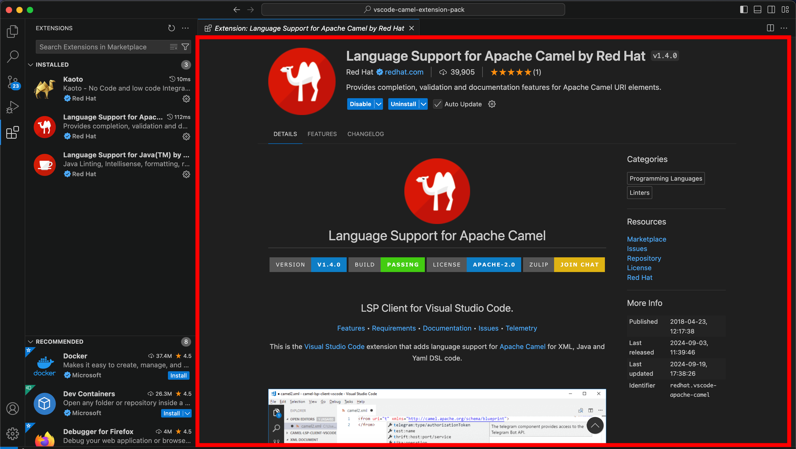

## Lookup

```typescript
import { ExtensionEditorView } from 'vscode-extension-tester';
...
const extensionEditor = new ExtensionEditorView();
```

## Get values from opened extension

You can get individual values using following functions:

```typescript
await extensionEditor.getName();

await extensionEditor.getVersion(); // For VS Code 1.96+ it is required to use 'extensionEditorDetailsSection.getVersion()' instead

await extensionEditor.getPublisher();

await extensionEditor.getDescription();

await extensionEditor.getCount();
```

## Manage tabs

Tabs section can be managed by this editor as well. For work with 'Details' you can use ExtensionEditorDetailsSection.

```typescript
await extensionEditor.getTabs();

await extensionEditor.switchToTab("tabname");

await extensionEditor.getActiveTab();
```
