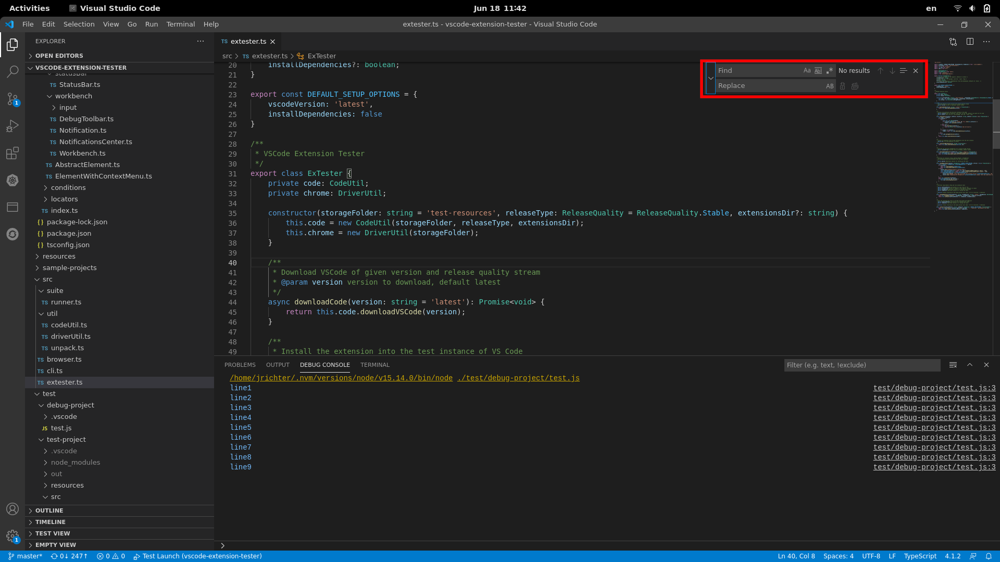

## Lookup

```typescript
// open the find widget from text editor
const editor = new TextEditor();
const widget = await editor.openFindWidget();
```

## Search

```typescript
// set search text
await widget.setSearchText('search text');
// get search text
const text = await widget.getSearchText();
// find next
await widget.nextMatch();
// find previous
await widget.previousMatch();
// get result counts
const counts = await widget.getResultCount();
const currentResultNumber = counts[0];
const totalCount = counts[1];
```

## Replace

```typescript
// toggle replace on/off
await widget.toggleReplace(true); // or false
// set replace text
await widget.setReplaceText('replacement');
// get replace text
const text = await widget.getReplaceText();
// replace current match
await widget.replace();
// replace all matches
await widget.replaceAll();
```

## Switches

```typescript
// switch 'Match Case' on/off
await widget.toggleMatchCase(true / false);
// switch 'Match Whole Word' on/off
await widget.toggleMatchWholeWord(true / false);
// switch 'Use Regular Expression' on/off
await widget.toggleUseRegularExpression(true / false);
// switch 'Preserve Case' on/off
await widget.togglePreserveCase(true / false);
```

## Close

```typescript
await widget.close();
```
