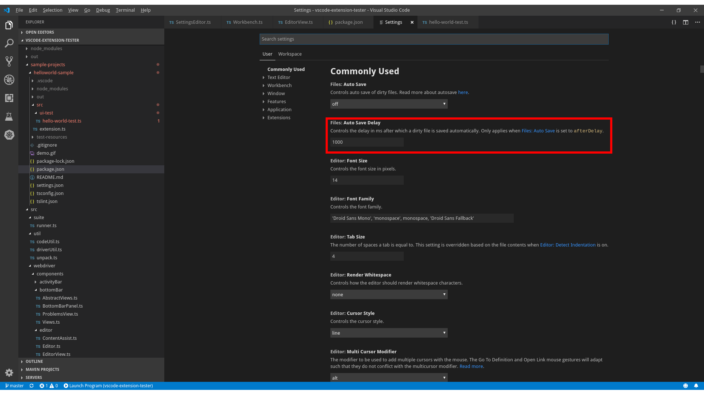

## Lookup

Settings can be located through a [SettingsEditor](/vscode-extension-tester/objects/editor/settings-editor/) object:

```typescript
import { Workbench } from 'vscode-extension-tester';
...
// open the settings editor and get a handle on it
const settingsEditor = await new Workbench().openSettings();

// look for a setting named 'Auto Save' under 'Files' category
const setting = await settingsEditor.findSetting('Auto Save', 'Files');
```

## Retrieve Information

```typescript
// get the title
const title = await setting.getTitle();

// get the category
const category = await setting.getCategory();

// get the description
const description = await setting.getDescription();
```

## Handling Values

All setting types share the same functions to manipulate their values, however the value types and possible options vary between setting types.

```typescript
// generic value retrieval
const value = await setting.getValue();

// generic setting of a value
await setting.setValue("off");
```

### Setting Value Types

Currently, there are five supported types of setting values: **text box**, **combo box**, **checkbox**, **link** and **array of strings**.

- **Text box** allows putting in an arbitrary string value, though there might be value checks afterwards that are not handled by this class.
- **Combo box** only allows inputs from its range of options. If you cast the setting to `ComboSetting`, you will be able to retrieve these options by calling the `getValues` method.
- **Check box** only accepts boolean values, other values are ignored
- **Link** does not have any value, `getValue` and `setValue` throw an error. Instead, casting the object to `LinkSetting` will allow you to call the `openLink` method, which will open settings.json file in a text editor.
- **Array** settings are supported for type `string`. Each row of array is represented by `ArraySettingItem`.

### Array Settings

Cast the setting to `ArraySetting` to manipulate the individual rows, each represented by an `ArraySettingItem`.

```typescript
const arraySetting = (await settingsEditor.findSetting('Exclude', 'Files')) as ArraySetting;

// add a new empty row and get its handle
const newItem = await arraySetting.add();
await newItem.setValue('**/out');
await newItem.ok();

// open an existing row for editing (by value or index), returns undefined if not found
const editItem = await arraySetting.edit('**/out');

// get all rows / values, or select a row (by value or index)
const items = await arraySetting.getItems();
const values = await arraySetting.getValues();
await arraySetting.select(0);

// ArraySettingItem actions
const item = items[0];
const value = await item.getValue();
await item.select();
await item.remove();
```
