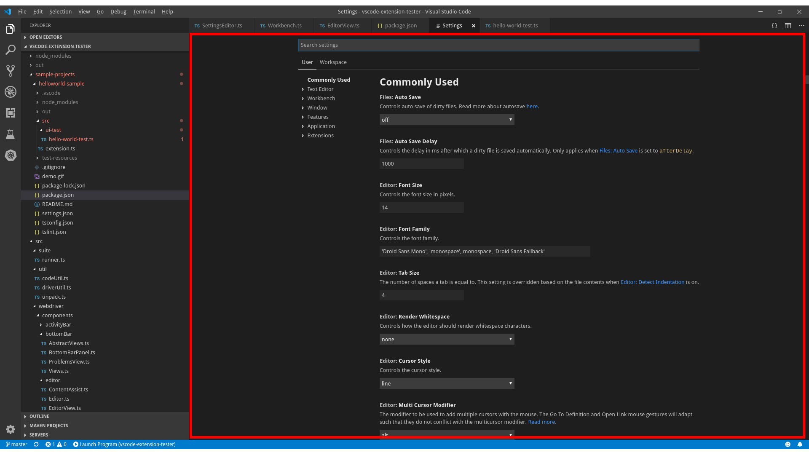

## Lookup

Settings editor can be opened through variety of ways, recommended way is using the [Workbench](/vscode-extension-tester/objects/workbench/workbench/) class:

```typescript
import { Workbench, SettingsEditor } from 'vscode-extension-tester'
...
const settingsEditor = await new Workbench().openSettings();
```

## Find a Setting Item in the Editor

Search for a setting with a given name and category, see more about the [Setting](/vscode-extension-tester/objects/editor/setting/) object:

```typescript
// look for a setting named 'Auto Save' under 'Files' category
const setting = await settingsEditor.findSetting("Auto Save", "Files");

// find a setting in nested categories, e.g. 'Enable' in 'Files' > 'Simple Dialog'
const setting1 = await settingsEditor.findSetting("Enable", "Files", "Simple Dialog");
```

## Find a Setting by ID

Look up a setting directly by its ID, the robust way to find extension-contributed settings:

```typescript
// e.g. the ID of 'Files > Auto Save' is 'files.autoSave'
const setting = await settingsEditor.findSettingByID("files.autoSave");
```

## Switch Settings Perspectives

VSCode has two perspectives for its settings: 'User' and 'Workspace'. If your VSCode instance loads from both user and workspace settings.json files, you will be able to switch the perspectives in the editor:

```typescript
// switch to Workspace perspective
await settingsEditor.switchToPerspective("Workspace");
```
