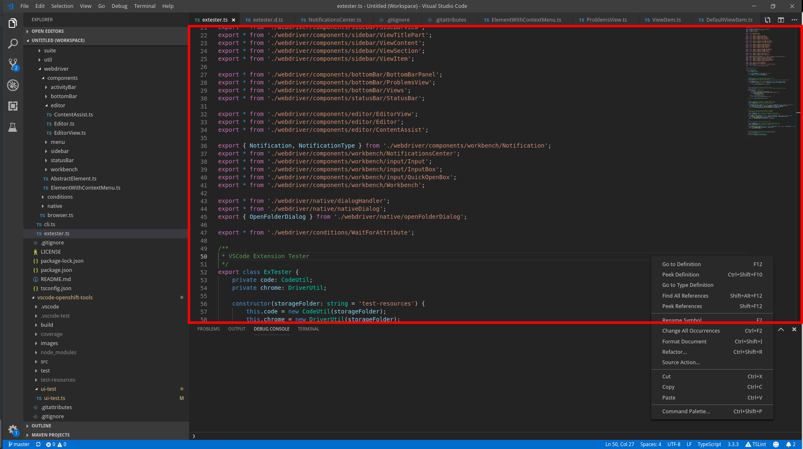

## Lookup

```typescript
import { TextEditor, EditorView } from 'vscode-extension-tester';
...
// to look up current editor
const editor = new TextEditor();
// to look up an open editor by name
const editor1 = await new EditorView().openEditor('package.json');
```

## Text Retrieval

Note: Most text retrieval and editing actions will make use of the clipboard.

```typescript
// get all text
const text = await editor.getText();
// get text at a given line number
const line = await editor.getTextAtLine(1);
// get number of lines in the document
const numberOfLines = await editor.getNumberOfLines();
```

## Editing Text

```typescript
// replace all text with a string
await editor.setText("my fabulous text");
// clear all text
await editor.clearText();
// replace text at a given line number
await editor.setTextAtLine(1, "my fabulous line");
// type text at the current coordinates
await editor.typeText("I have the best text");
// type text starting at given coordinates (line, column)
await editor.typeTextAt(1, 3, " absolutely");
// format the whole document with built-in tools
await editor.formatDocument();
// move the cursor to the given coordinates
await editor.moveCursor(3, 6);
// set cursor to given position using command prompt :Ln,Col
// preferred, faster alternative to moveCursor (both also accept an optional timeout)
await editor.setCursor(2, 5);
// get the current cursor coordinates as number array [line, column], both 1-based
const coords = await editor.getCoordinates();
// get the current indentation of opened editor
const indent = await editor.getIndentation();
console.log(`indentation label = ${indent.label} and value = ${indent.value}`);
```

## Save Changes

```typescript
// find if the editor has changes
const hasChanges = await editor.isDirty();
// save the document
await editor.save();
// save as, this only opens the save prompt
const prompt = await editor.saveAs();
```

## Get Document File Path

```typescript
const path = await editor.getFilePath();
// or as a file URI
const uri = await editor.getFileUri();
```

## Content Assist

```typescript
// open content assist at current position
const contentAssist = await editor.toggleContentAssist(true);
// close content assist
await editor.toggleContentAssist(false);
```

## Search for Text

```typescript
// get line number that contains some text
const lineNum = await editor.getLineOfText("some text");
// find and select text
await editor.selectText("some text");
// get selected text as string
const text = await editor.getSelectedText();
// get selection block as a page object
const selection = await editor.getSelection();
// open the Find (search) widget
const find = await editor.openFindWidget();
```

## Breakpoints

```typescript
// toggle breakpoint on a line with given number, resolves to true when a breakpoint was added
const toggled = await editor.toggleBreakpoint(1);
// get a breakpoint on a given line, returns undefined if there is none
const breakpoint = await editor.getBreakpoint(1);
// get all breakpoints in the editor
const breakpoints = await editor.getBreakpoints();
// get the breakpoint the debugger is currently paused on, returns undefined if not paused
const paused = await editor.getPausedBreakpoint();
```

## CodeLenses

```typescript
// get a code lens by (partial) text
const lens = await editor.getCodeLens("my code lens text");
// get code lens by index (zero-based from the top of the editor)
const firstLens = await editor.getCodeLens(0);
// get all code lenses
const lenses = await editor.getCodeLenses();

// now you can trigger the lens actions by clicking
await lens.click();

// or just get the text
const text = await lens.getText();
const tooltip = await lens.getTooltip();
```
