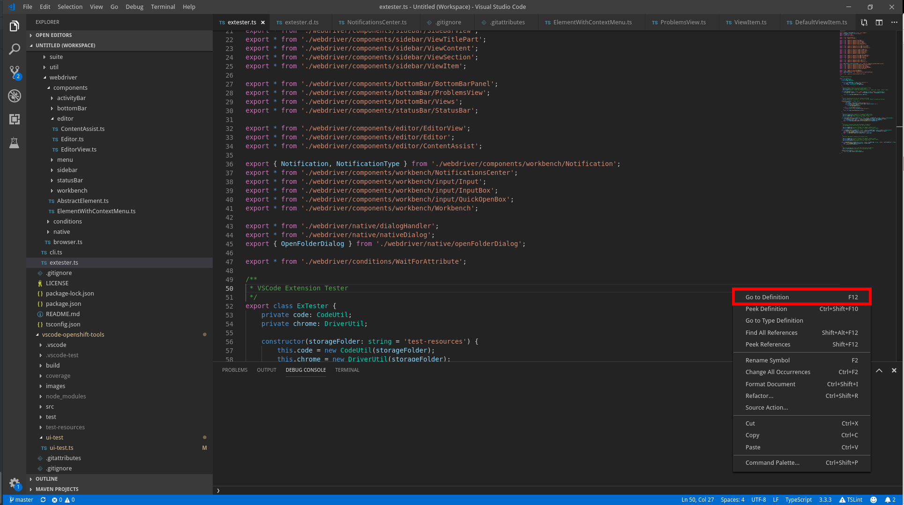

## Lookup

One can retrieve an item from an open context menu, much like follows:

```typescript
import { ActivityBar } from 'vscode-extension-tester';
...
const menu = await new ActivityBar().openContextMenu();
const item = await menu.getItem('References');
```

## Select/Click

```typescript
// if item has no children
await item.select();
// if there is a submenu under the item
const submenu = await item.select();
```

## Get Parent Menu

```typescript
const parentMenu = item.getParent();
```

## Get Label

```typescript
const label = await item.getLabel();
```
