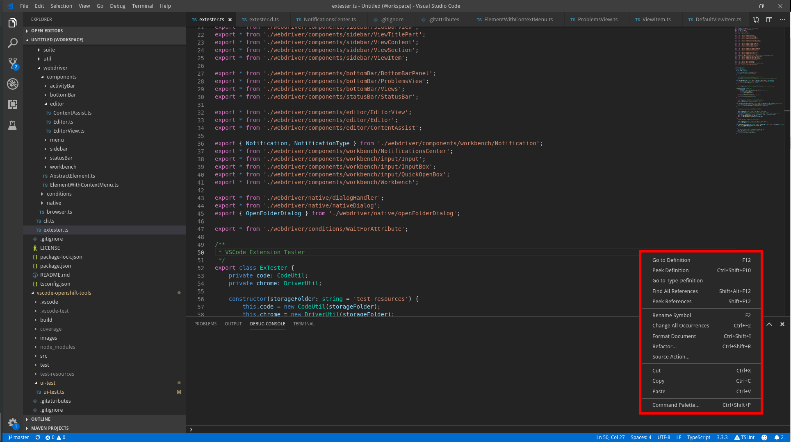

Page object for any context menu opened by right-clicking an element that has a context menu. Title bar items also produce context menus when clicked.

Note: on newer VS Code versions some menus (notably the text editor's) are rendered in a workbench-level shadow root instead of the element's own subtree; the framework handles both shapes transparently.

## Open/Lookup

Typically, a context menu is opened by calling `openContextMenu` on elements that support it. For example:

```typescript
import { ActivityBar, ContextMenu } from 'vscode-extension-tester';
...
const menu = await new ActivityBar().openContextMenu();
```

## Retrieve Items

```typescript
// find if an item with title exists
const exists = await menu.hasItem("Copy");
// get a handle for an item
const item = await menu.getItem("Copy");
// get all displayed items
const items = await menu.getItems();
```

## Select Item

```typescript
// recursively select an item in nested submenus
await menu.select("File", "Preferences", "Settings");
// select an item that has a child submenu
const submenu = await menu.select("File", "Preferences");
```

## Close the Menu

Close the context menu without selecting anything.

```typescript
await menu.close();
```
