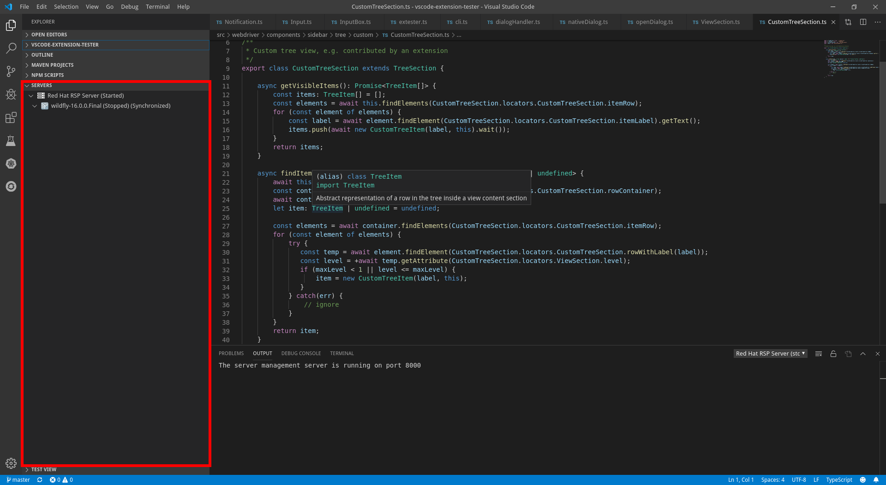

The 'custom' tree section, usually contributed by extensions as TreeView. All The behavior is defined by the general [ViewSection](/vscode-extension-tester/objects/side-bar/view-section/) class.

## Lookup

```typescript
import { SideBarView, CustomTreeSection } from 'vscode-extension-tester';
...
// Type is inferred automatically, the type cast here is used to be more explicit
const section = await new SideBarView().getContent().getSection('servers') as CustomTreeSection;
```

## Find Items

In addition to a label string, `findItem` also accepts a predicate function.

```typescript
// find an item by label
const item = await section.findItem('itemLabel');
// find an item using a predicate function
const item1 = await section.findItem(async (el) => (await el.getLabel()).startsWith('item'));
```

## Get Welcome Content

Some sections may provide a welcome content when their tree is empty.

```typescript
// find welcome content, return undefined if not present
const welcome = await section.findWelcomeContent();

// get all the possible buttons and paragraphs in a list
const contents = await welcome.getContents();

// get all buttons
const btns = await welcome.getButtons();

// get specific button
const btn = await welcome.getButton("title");

// get paragraphs as strings in a list
const text = await welcome.getTextSections();
```
