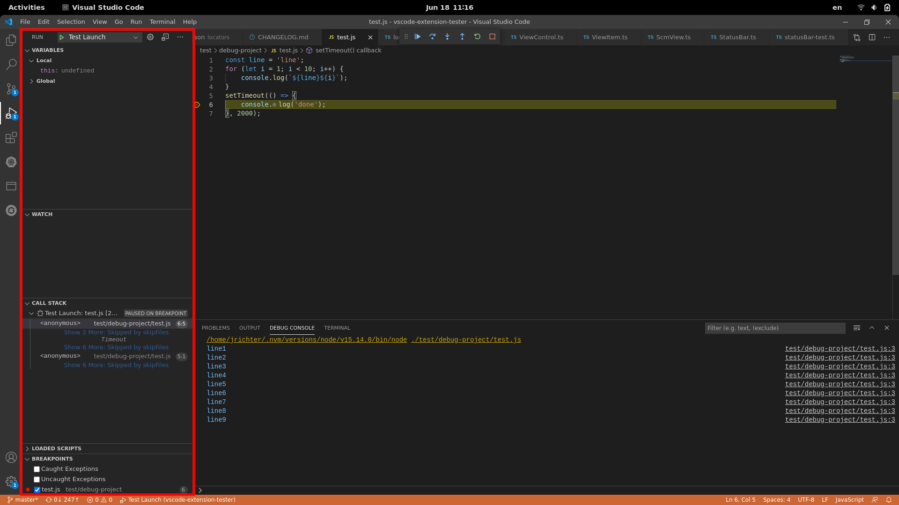
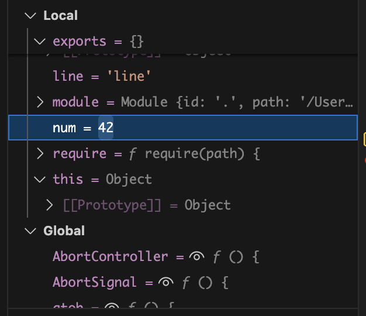
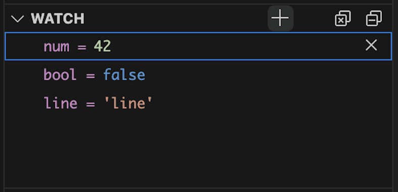
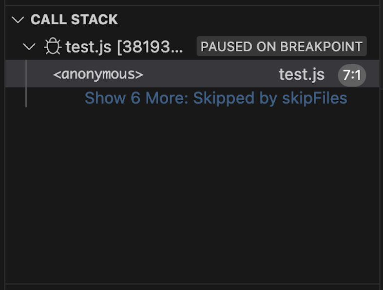

### Lookup

```typescript
// open the view using the icon in the view container
const btn = await new ActivityBar().getViewControl("Run");
const debugView = (await btn.openView()) as DebugView;
```

### Launch Configurations

```typescript
// get title of current launch configuration
const config = await debugView.getLaunchConfiguration();
// get titles of all available launch configurations
const configs = await debugView.getLaunchConfigurations();
// select launch configuration by title
await debugView.selectLaunchConfiguration("Test Launch");
```

**Warning:** `getLaunchConfiguration()` is deprecated — on Windows and Linux with VS Code 1.87+ it throws an error, it only keeps working on macOS. Use `getLaunchConfigurations()` instead.

### Launch

```typescript
// start selected launch configuration
await debugView.start();
```

## Sections

It's possible to work with all individual sections.

### Variables



```typescript
import { DebugVariableSection } from 'vscode-extension-tester';
...
const variablesSection = await debugView.getVariablesSection();
...
await variablesSection?.openItem('Local'); // open section
const item = await variablesSection.findItem('variableName'); // get one variable
const items = await variablesSection.getVisibleItems(); // get all variables
...
const name = await item.getVariableName(); // get name
const value = await item.getVariableValue(); // get current value
await item.setVariableValue('newValue'); // change value
```

### Watch



```typescript
import { WatchSection } from 'vscode-extension-tester';
...
const watchSection = await debugView.getWatchSection();
...
const items = await watchSection.getVisibleItems(); // get all items
await watchSection.removeAllExpressions(); // remove all expressions
...
await watchSection.addItem('name'); // add new expression
const item = items.at(num); // get expression at position num
const label = await item.getLabel(); // get label of expression
const value = await item.getValue(); // get value of expression
await item.remove(); // remove expression from watch section
```

### Call Stack



```typescript
import { DebugCallStackSection } from 'vscode-extension-tester';
...
const callStack = await debugView.getCallStackSection();
...
const items = await callStack.getVisibleItems(); // get all items
...
const item = items.at(num); // get item at position num
const label = await item.getLabel(); // get label of item
const text = await item.getText(); // get text of item
const btns = await item.getActionButtons(); // get available action buttons
```

### Breakpoints

```typescript
import { DebugBreakpointSection } from 'vscode-extension-tester';
...
const breakpointSection = await debugView.getBreakpointSection();
...
const item = await breakpointSection.findItem('app.js'); // get a breakpoint item
const enabled = await item.isBreakpointEnabled(); // find if the breakpoint is enabled
await item.setBreakpointEnabled(true); // enable/disable the breakpoint
const line = await item.getBreakpointLine(); // get the line number of the breakpoint
```
