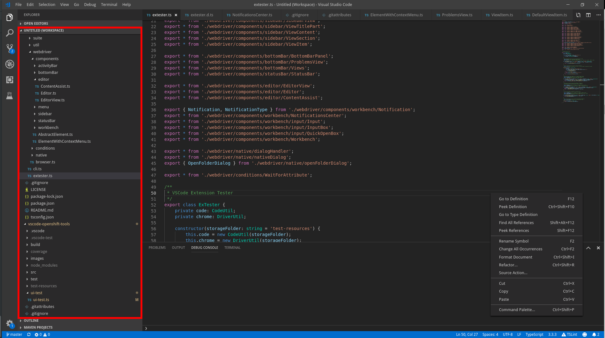

The 'default' tree section, as used in the explorer view. All The behavior is defined by the general [ViewSection](/vscode-extension-tester/objects/side-bar/view-section/) class.

## Lookup

```typescript
import { SideBarView, DefaultTreeSection } from 'vscode-extension-tester';
...
// Type is inferred automatically, the type cast here is used to be more explicit
const section = await new SideBarView().getContent().getSection('workspace') as DefaultTreeSection;
```
