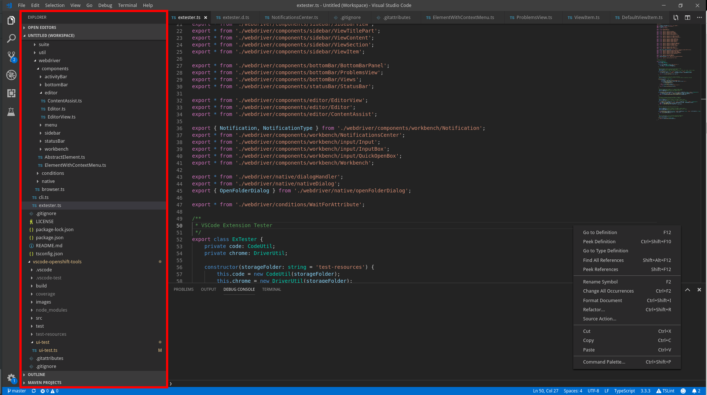

## Lookup

```typescript
import { ActivityBar, SideBarView } from "vscode-extension-tester";
// to look up the currently open view (if any is open)
const view = new SideBarView();
// to open a specific view and look it up
const control = await new ActivityBar().getViewControl("Explorer");
const view1 = await control.openView();
```

## Get Individual Parts

```typescript
// to get the title part
const titlePart = await view.getTitlePart();
// to get the content part
const content = await view.getContent();
```
