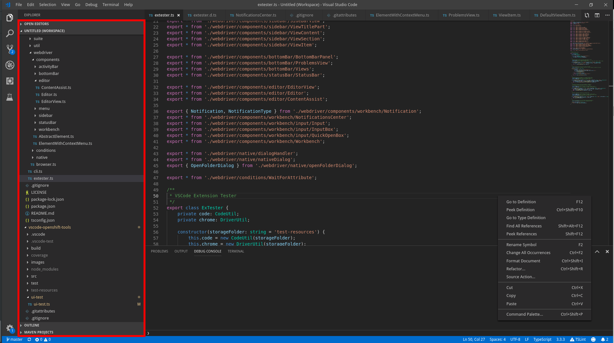

## Lookup

```typescript
import { SideBarView } from 'vscode-extension-tester';
...
const contentPart = new SideBarView().getContent();
```

## Get Sections

```typescript
// get a section by title, case insensitive
const section = await contentPart.getSection("Open Editors");
// get all sections
const sections = await contentPart.getSections();
```

## Progress Bar

```typescript
// look if there is an active progress bar
const hasProgress = await contentPart.hasProgress();
```
