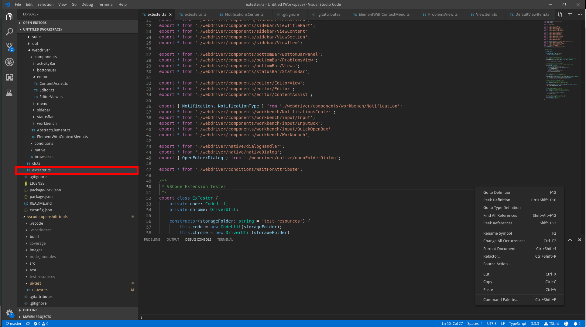

## Lookup

The best way to get an item reference is to use the `findItem` method from `ViewSection`.

```typescript
const viewSection = ...;
const item = await viewSection.findItem('package.json');
```

## Actions

```typescript
// get item's label
const label = await item.getLabel();
// get item's description if present
const description = await item.getDescription();
// find if the item can be expanded
const isExpandable = await item.isExpandable();
// try to expand the item and find if it has children
const isParent = await item.hasChildren();
// find if item is expanded
const isExpanded = await item.isExpanded();
// expand the item if collapsed
await item.expand();
// collapse the item if expanded
await item.collapse();
// select (click) the item
await item.select();
// get the item's children (expands the item if needed)
const children = await item.getChildren();
// find a direct child item by label, returns undefined if not found
const child = await item.findChildItem("name");
// get the tooltip if present
const tooltip = await item.getTooltip();
```

## Action Buttons

Tree items may have action buttons that show on hover.

```typescript
// get all action buttons of the item
const buttons = await item.getActionButtons();
// get an action button by label, returns undefined if not found
const button = await item.getActionButton("label");
```
