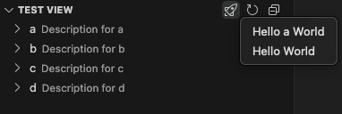

This is an abstract class for side bar view sections. Most behavior is defined here, but for specifics, check out the specific subtypes.

## Lookup

Get a section handle from an open side bar.

```typescript
import { SideBarView } from 'vscode-extension-tester';
...
const section = await new SideBarView().getContent().getSection('workspace');
```

## Section Manipulation

```typescript
// get the section title
const title = await section.getTitle();
// collapse section if possible, takes an optional timeout in ms (default 1000)
await section.collapse();
// expand if possible, takes an optional timeout in ms (default 1000)
await section.expand();
// find if section is expanded
const expanded = await section.isExpanded();
```

## Action Buttons

Section header may also contain some action buttons.

```typescript
// get an action button by label
const action = (await section.getAction("New File")) as ViewPanelAction;
// get all action buttons for the section
const actions = await section.getActions();
// click an action button
await action.click();
// open the 'More Actions...' context menu if available, returns undefined otherwise
const menu = await section.moreActions();
```

### Action Buttons - Dropdown



**Note:** Be aware that it is not supported on macOS. For more information see [Known Issues](https://github.com/redhat-developer/vscode-extension-tester/blob/main/KNOWN_ISSUES.md#macos-known-limitations-of-native-objects).

```typescript
// find an view action button by title
const action = (await section.getAction("Hello Who...")) as ViewPanelActionDropdown;
// open the dropdown for that button
const menu = await action.open();
// select an item from an opened context menu
await menu.select("Hello a World");
```

## (Tree) Items Manipulation

```typescript
// get all visible items, note that currently not shown on screen will not be retrieved
const visibleItems = await section.getVisibleItems();
// find an item with a given label, involves scrolling to items currently not showing
const item = await section.findItem("package.json");
// recursively navigate to an item and click it
// if the item has children (./src/webdriver/components folder)
const children = await section.openItem("src", "webdriver", "components");
// if the item is a leaf
await section.openItem("src", "webdriver", "components", "AbstractElement.ts");
```
