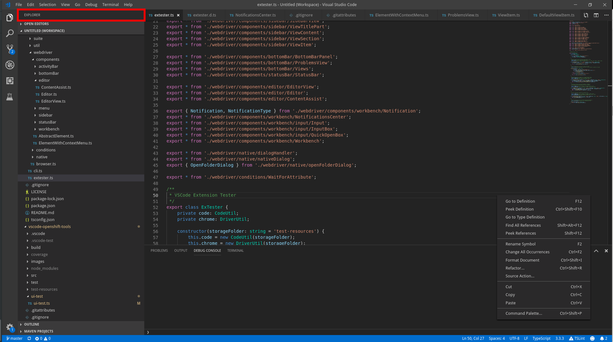

## Lookup

```typescript
import { SideBarView } from 'vscode-extension-tester';
...
const titlePart = new SideBarView().getTitlePart();
```

## Get Title

```typescript
const title = await titlePart.getTitle();
```

## ActionButtons

Some views have action buttons in their title part.

```typescript
// get action button by title
const button = await titlePart.getAction("Clear");
// get all action buttons
const buttons = await titlePart.getActions();
// click a button
await button.click();
```
