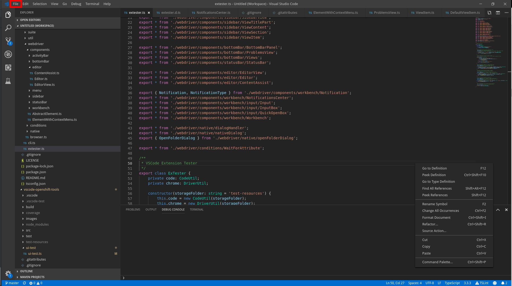

## Lookup

```typescript
import { TitleBar } from "vscode-extension-tester";

// get an item from the title bar
const item = await new TitleBar().getItem("File");
```

## Select the Item

```typescript
const contextMenu = await item.select();
```

The rest of the functionality is exactly the same as other menu items, like [ContextMenuItem](/vscode-extension-tester/objects/menu/context-menu-item/).
