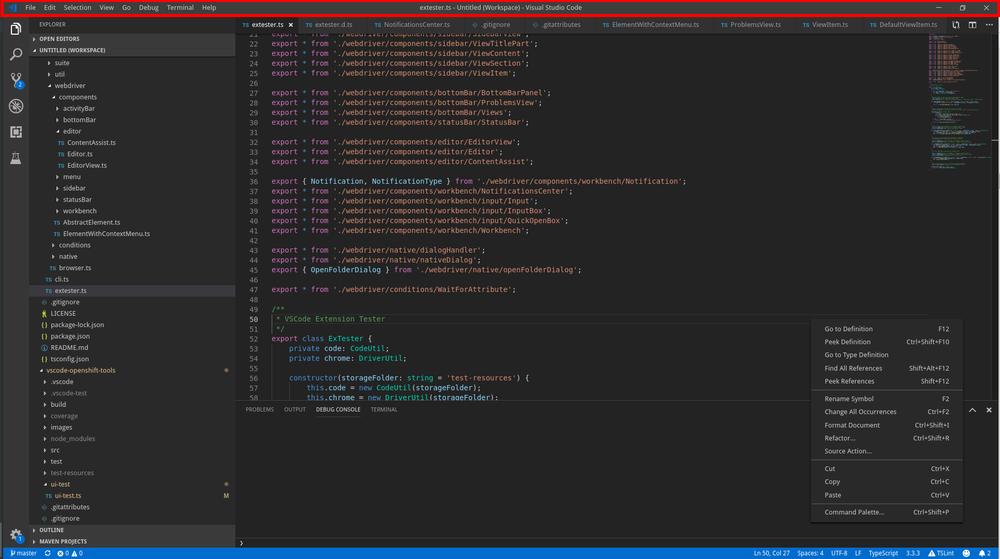

Page object for the title bar. Requires the custom title bar (`window.titleBarStyle: custom`), which ExTester sets by default (along with `window.menuStyle: custom` on VS Code 1.101+), so it works out of the box unless you override the framework's default settings. Native title bar is not supported.

## Lookup

```typescript
import { TitleBar } from 'vscode-extension-tester';
...
const titleBar = new TitleBar();
```

## Item Retrieval

```typescript
// find if an item with title exists
const exists = await titleBar.hasItem("File");
// get a handle for an item
const item = await titleBar.getItem("File");
// get all displayed items
const items = await titleBar.getItems();
```

## Get Displayed Title

```typescript
const title = await titleBar.getTitle();
```

## Get Window Controls Handle

```typescript
const controls = titleBar.getWindowControls();
```
