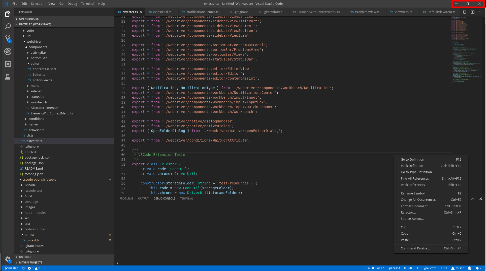

Controls to the whole window. Use at your own risk.

## Lookup

```typescript
import { TitleBar } from 'vscode-extension-tester';
...
const controls = new TitleBar().getWindowControls();
```

## Manipulate Window

```typescript
// minimize
await controls.minimize();
// maximize
await controls.maximize();
// restore
await controls.restore();
// close... if you dare
await controls.close();
```
