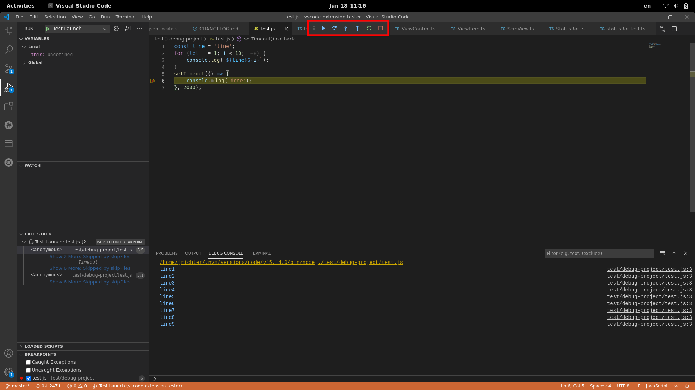

## Lookup

```typescript
// get a handle for existing toolbar (i.e. debug session needs to be in progress)
// takes an optional timeout in ms (default 5000)
const bar = await DebugToolbar.create();
```

## Buttons

```typescript
// continue
await bar.continue();
// pause
await bar.pause();
// step over
await bar.stepOver();
// step into
await bar.stepInto();
// step out
await bar.stepOut();
// restart
await bar.restart();
// stop
await bar.stop();
// disconnect (unlike stop, detaches from an attached debug session)
await bar.disconnect();
```

## Wait for code to pause again

Takes an optional timeout in ms (default 10000).

```typescript
await bar.waitForBreakPoint();
```
