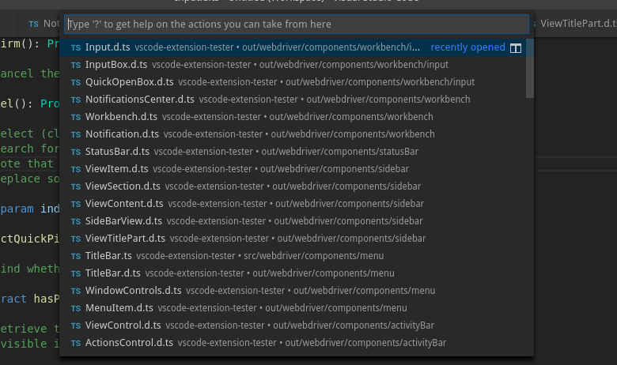
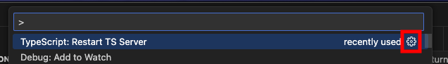

There are two types of input boxes in VS Code: 'quick input' and 'quick open'. They can both be made to look the same, have nearly the same functionality, but different DOM. Hence each is handled by a different page object. Make sure you look for the correct type, otherwise you will likely receive a lookup error.

Another caveat of an input box in VS Code is that unless it has already been opened, the underlying DOM element does not exist. This may result in lookup errors when using the constructor to search for input boxes. Instead, we recommend using the static `create` method that will safely wait for the element to appear.

## InputBox

This is the page object for the plain and simple input box you either put some text into, or just pick from the quick pick selection.

### Lookup

There are no methods that explicitly open and return a handle to an input box. So first make sure it is opened before you try to handle it.

```typescript
import { InputBox } from 'vscode-extension-tester';
...
// safe way to find an inputbox
const input = await InputBox.create();

// only use when manually waiting for the element, or when inputbox has already been opened
const input1 = new InputBox();
```

### Quick Input Message

The only difference in the GUI to quick open box is the option to display a message underneath a quick input box. To get it, use:

```typescript
const message = await input.getMessage();
```

### InputBox-specific Queries

```typescript
// get quick pick items that have a checkbox
const checkboxes = await input.getCheckboxes();
// find if the input has an error decoration
const error = await input.hasError();
// find if the input is masked as a password field
const password = await input.isPassword();
```

## QuickOpenBox

**As of VS Code 1.44.0, QuickOpenBox is no longer in use. InputBox is used exclusively.**

Analogically to quick input, this is the page object handling quick open box. This type of input is usually used to (apart from other functions) open files or folders. The command prompt is also built on this element.

### Lookup

```typescript
import { QuickOpenBox } from 'vscode-extension-tester';
...
// safe way to find a quickopenbox
const input = await QuickOpenBox.create();

// only use when manually waiting for the element, or when quickopenbox has already been opened
const input1 = new QuickOpenBox();
```

## Common Functionality

### Text Manipulation

```typescript
// get text in the input box
const text = await input.getText();
// replace text in the input box with a string
await input.setText("amazing text");
// clear the text in the input box
await input.clear();
// get the placeholder text
const placeholder = await input.getPlaceHolder();
```

### Actions

```typescript
// confirm (press enter in the input)
await input.confirm();
// cancel (press escape in the input)
await input.cancel();
// get quick pick options
const picks = await input.getQuickPicks();
// search for a quick pick item by text or index and click it (includes scrolling if item is not visible)
await input.selectQuickPick(1);
await input.selectQuickPick("Input.d.ts");
// search for a quick pick item and get a handle for it (includes scrolling if item is not visible)
const pick = await input.findQuickPick(1);
const pick2 = await input.findQuickPick("Input.d.ts");
// confirm the current path in a file/folder picker, appending a path separator
await input.confirmPath();
// check/uncheck all quick pick checkboxes ('Select All' toggle)
await input.toggleAllQuickPicks(true);
```

### Progress

```typescript
// find if there is an active progress bar
const hasProgress = await input.hasProgress();
```

### Title Bar

An input box can have its own title bar for the multi step flow

```typescript
// get the current title, returns undefined if no title bar is present
const title = await input.getTitle();
// click the back button from the title bar
await input.back();
```

## QuickPickItem

Page objects retrieved when calling `getQuickPick`

```typescript
const picks = await input.getQuickPicks();
const pick = picks[0];
```

### Actions

```typescript
// get the item's label (prefer this over the generic getText)
const label = await pick.getLabel();
// get the item's description if present
const description = await pick.getDescription();
// find if the item is currently selected (highlighted)
const selected = await pick.isSelected();
// get index
const index = pick.getIndex();
// select (click) the item (recommend to use input.selectQuickPick() if possible)
await pick.select();
// get action button(s)
const buttons = await pick.getActions();
const button = await pick.getAction("name");
```

## QuickInputAction



Page object retrieved when calling `getAction` or `getActions` representing Quick Input Actions.

```typescript
// get label
const label = await button.getLabel();
const label1 = await (await buttons).at(1).getLabel();
```
