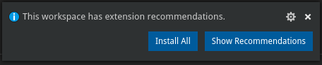

## Lookup

To get notifications outside the notifications center, one should use a `Workbench` object:

```typescript
import { Workbench } from 'vscode-extension-tester';
...
const notifications = await new Workbench().getNotifications();
const notification = notifications[0];
```

## Get Some Info

```typescript
// get the message
const message = await notification.getMessage();
// get the type (error/warning/info)
const type = await notification.getType();
// get the source as string, if shown
const source = await notification.getSource();
// find if there is an active progress bar
const hasProgress = await notification.hasProgress();
```

## Take Action

```typescript
// dismiss the notification
await notification.dismiss();
// expand the notification if it is collapsed
await notification.expand();
// get available actions (buttons)
const actions = await notification.getActions();
// get an action's title (text)
const title = await actions[0].getTitle();
// take action (i.e. click a button with title)
await notification.takeAction("Install All");
```
