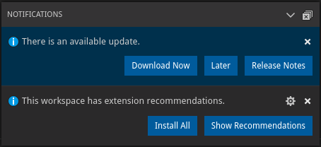

## Lookup

To open the notifications center, use either `Workbench` or `StatusBar` object:

```typescript
import { Workbench, StatusBar, NotificationType } from 'vscode-extension-tester';
...
center = await new Workbench().openNotificationsCenter();
center1 = await new StatusBar().openNotificationsCenter();
```

## Get the Notifications

```typescript
// get all notifications
const notifications = await center.getNotifications(NotificationType.Any);
// get info notifications
const infos = await center.getNotifications(NotificationType.Info);
```

## Clear and Close

```typescript
// clear all notifications
await center.clearAllNotifications();
// close the notifications center
await center.close();
```
