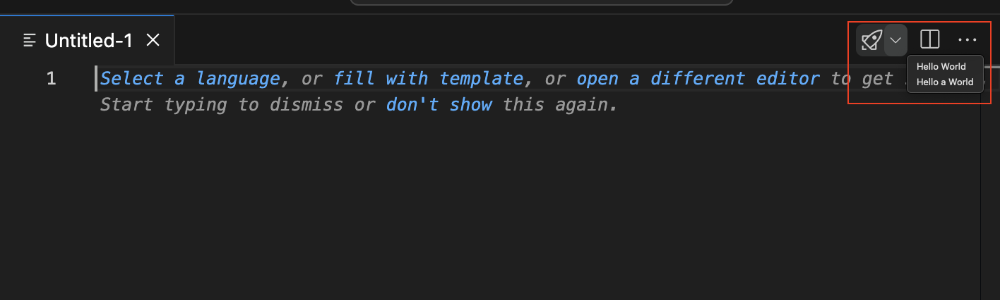

#### Lookup

```typescript
import { EditorView } from 'vscode-extension-tester';
...
const editorView = new EditorView();
```

#### Select an Editor Tab

```typescript
// open editor tab by title
const editor = await editorView.openEditor("package.json");
```

#### Closing Editors

```typescript
// close an editor tab by title
await editorView.closeEditor("package.json");
// close all open tabs
await editorView.closeAllEditors();
```

#### Retrieve Open Tab Titles

```typescript
const titles = await editorView.getOpenEditorTitles();
```

#### Editor Actions

```typescript
// find an editor action button by title
const button = await editorView.getAction("Open Changes");
// also works for multiple editor groups, select the group by index, starting with 0 from the left
const buttonFromSecondGroup = await editorView.getAction("More Actions...", 1);
// get all visible action buttons, again you may specify a group index, default is 0
const buttons = await editorView.getActions();
```

##### Editor Actions - Dropdown



**Note:** Be aware that it is not supported on macOS. For more information see [Known Issues](../KNOWN_ISSUES.md).

```typescript
// find an editor action button by title
const action = (await view.getAction("Run or Debug...")) as EditorActionDropdown;
// open the dropdown for that button
const menu = await action.open();
// select an item from an opened context menu
await menu.select("Hello a World");
```

### Editor Groups

By default, all EditorView methods work with the first (left-most) editor group, except `closeAllEditors` and `getOpenEditorTitles` which by default work across all groups. You can use indices to target specific editor groups, or you can get handles to directly work with `EditorGroup` objects.

#### EditorView Actions on Editor Groups

```typescript
// open editor in the second group (from the left, using a zero-based index)
const editor = await editorView.openEditor("package.json", 1);

// close editor in the second group
await editorView.closeEditor("package.json", 1);

// close all editors in the second group (and the whole group)
await editorView.closeAllEditors(1);

// get open editor titles for the second group
const titles = await editorView.getOpenEditorTitles(1);
```

#### Retrieve Handles for the Editor Groups

Instead of working in context of the whole editor view, you can get a handle for a particular editor group. The `EditorGroup` object then exposes the same set of methods as `EditorView` (without the group retrieval though).

```typescript
// get the handle for the second group
const group = await editorView.getEditorGroup(1);

// get handles for all editor groups in an array
const groups = await editorView.getEditorGroups();
```

### Editor Tabs

Another way to handle open editors is using the editor tabs. For that we have the `EditorTab` page object.

#### Lookup

There are two basic ways to get `EditorTab` objects, through `EditorView`/`EditorGroup`:

```typescript
// using EditorView, the same principle applies to EditorGroup
// get tab by title from the first group
const tab = await editorView.getTabByTitle("Index.d.ts");
// get all open tabs in a list
const tabs = await editorView.getOpenTabs();
// get the active tab (or undefined if none is active)
const active = await editorView.getActiveTab();
```

From an `Editor` instance:

```typescript
const editor = await editorView.openEditor("Index.d.ts");
const etab = await editorView.getTab();
```

#### Actions

```typescript
// get the tab title
const title = await tab.getTitle();
// select the tab
await tab.select();
// open the tab context menu
const menu = await tab.openContextMenu();
```
