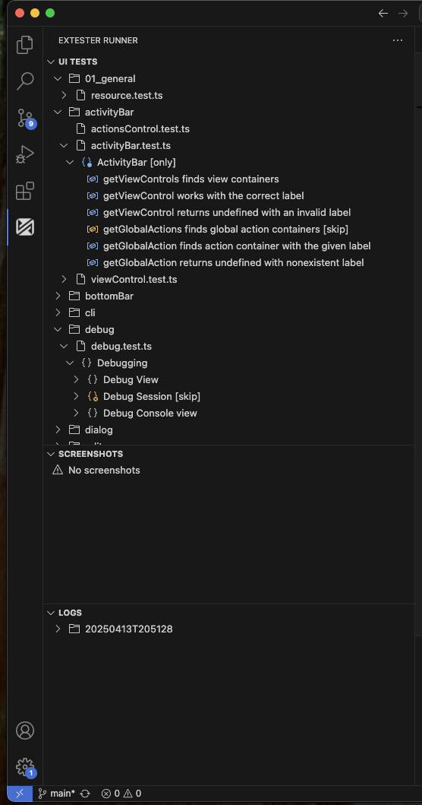

# ExTester Runner

## Quick Start

1. Install the ExTester Runner extension from the VS Code marketplace
2. Open your VS Code extension project
3. Click the ExTester Runner icon in the Activity Bar
4. Find your test in the Test Explorer
5. Click the play button (▶️) to run it

## What is ExTester Runner?

ExTester Runner is a VS Code extension that provides a comprehensive UI for running and managing UI tests for VS Code extensions using the ExTester framework. It offers a seamless testing experience directly within VS Code, eliminating the need to switch between different tools or environments.

The extension integrates into VS Code's Activity Bar and provides three main views:

- **UI Tests**: A hierarchical view of test files and their structure (Mocha `describe/it` blocks)
- **Screenshots**: A view of screenshot image files captured during test runs
- **Logs**: A view of log files generated during test executions

## How it Works

### Core Functionality

1. **Test Discovery and Organization**
   - Automatically discovers test files based on configured glob patterns
   - Organizes tests in a hierarchical structure matching your project's folder layout
   - Supports Mocha's test structure with `describe` and `it` blocks
   - Provides visual indicators for test status and modifiers (`.only`, `.skip`)

2. **Test Execution**
   - One-click test running for individual files, folders or all tests
   - Supports running tests at different levels:
     - Test file (all tests in a file)
     - All test files in a folder
     - All tests in the workspace

3. **Test, Logs and Screenshots Management**
   - Automatic refresh of views when test files change
   - Provides quick navigation to test source code
   - Displays screenshots from test runs with automatic refresh
   - Provides quick access to view captured screenshots
   - Maintains and organizes test logs with refresh
   - Enables quick opening of log files

### Configuration

The extension is highly configurable through VS Code settings:

1. **View Configuration**
   - `testFileGlob`: Pattern to locate test files (default: `**/ui-test/**/*.test.ts`)
   - `excludeGlob`: Pattern to exclude paths from test search (default: `**/node_modules/**`)
   - `ignorePathPart`: Pattern to hide specific path segments in the test view

2. **Test Execution Settings**
   - `outputFolder`: Directory for compiled test files
   - `rootFolder`: Root source directory for test files
   - `tempFolder`: Directory for temporary test files
   - `vsCodeVersion`: VS Code version for test execution
   - `vsCodeType`: VS Code build type (stable/insider)
   - `additionalArgs`: Additional CLI arguments for test runner

3. **Log Management**
   - `hideEmptyLogFolders`: Controls visibility of empty log directories

## Setup and Configuration

### Initial Setup

The extension provides a built-in walkthrough to help you get started quickly. To access it:

1. Open VS Code
2. Go to the Command Palette (Ctrl+Shift+P / Cmd+Shift+P)
3. Type "Get Started with ExTester Runner" and select it

The walkthrough will guide you through the essential configuration steps:

1. **Configure Root and Output Directories**
   - Set up your test environment by configuring:
     - Root Folder: Where your test files are located
     - Output Folder: Where compiled tests are stored

2. **Configure Test File Pattern**
   - Set up the pattern that ExTester Runner will use to find your test files
   - Default pattern: `**/ui-test/**/*.test.ts`

3. **Configure Excluded Paths**
   - Specify which paths should be excluded from test file searches
   - Default exclusion: `**/node_modules/**`

4. **Customize Path Display (Optional)**
   - Improve test view readability by hiding specific path segments

5. **Additional Arguments (Optional)**
   - Configure additional command line arguments for ExTester

### Manual Configuration

If you prefer to configure the extension manually, you can access all settings through VS Code's settings panel:

1. Open VS Code Settings (Ctrl+, / Cmd+,)
2. Search for "ExTester Runner"
3. Configure the following settings:

4. **View Configuration**
   - `testFileGlob`: Pattern to locate test files (default: `**/ui-test/**/*.test.ts`)
   - `excludeGlob`: Pattern to exclude paths from test search (default: `**/node_modules/**`)
   - `ignorePathPart`: Pattern to hide specific path segments in the test view

5. **Test Execution Settings**
   - `outputFolder`: Directory for compiled test files
   - `rootFolder`: Root source directory for test files
   - `tempFolder`: Directory for temporary test files
   - `vsCodeVersion`: VS Code version for test execution
   - `vsCodeType`: VS Code build type (stable/insider)
   - `additionalArgs`: Additional CLI arguments for test runner

6. **Log Management**
   - `hideEmptyLogFolders`: Controls visibility of empty log directories

### Getting Started

1. Install the ExTester Runner extension from the VS Code marketplace
2. Open your VS Code extension project
3. Configure the necessary settings through VS Code's settings panel
4. Use the Activity Bar to access the ExTester Runner views

The extension includes a built-in walkthrough to help users get started quickly, guiding them through the essential configuration steps.
