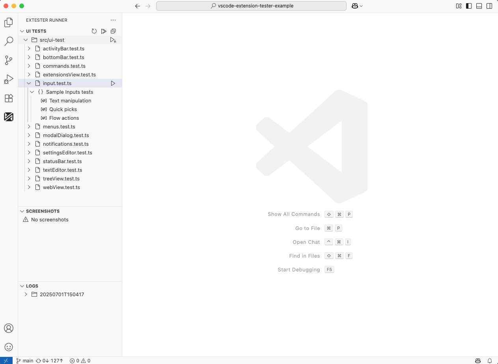

<h1 align="center">
  
  
ExTester Runner

</h1>

Extension for running and managing UI tests for VS Code extensions using the ExTester framework.
 

  

## Prerequisites

Before you start using ExTester Runner, make sure you have:

- A VS Code extension project that you want to test
- Your extension's UI tests written in TypeScript using vscode-extension-tester
- Node.js

## Installation & Getting Started

1. Install the extension from the VS Code marketplace
2. Open your VS Code extension project
3. Set up your test project using the "Get Started with ExTester Runner" walkthrough in VS Code
4. Configure the ExTester Runner settings in VS Code preferences

## Features

### Activity Bar Integration

- **ExTester Runner** container in the VS Code Activity Bar with three custom tree views:
  - UI Tests: Displays test files and their structure (Mocha `describe/it` blocks)
  - Screenshots: Shows screenshot image files from test runs
  - Logs: Displays log files from test executions

### One-Click Test Running

The extension makes running tests incredibly simple and efficient:

#### Quick Start

1. Open your VS Code extension project
2. Click the ExTester Runner icon in the Activity Bar
3. Find your test in the Test Explorer
4. Click the play button (▶️) to run it

#### Running Tests

- **Test Suite**: Click the play button next to a `describe()` block to run all tests in that suite
- **Test File**: Click the play button next to a test file to run all tests in that file
- **All Tests**: Click the play button at the top of the Test Explorer to run everything

### Test Management

- Hierarchical view of test files with:
  - Folder structure
  - Test files with icons and labels
  - Nested test suites (`describe` blocks) and test cases (`it` blocks)
  - Visual indicators for test status (including `.only` and `.skip` modifiers)
  - Click-to-navigate functionality to test source code

### Automatic Updates

- Test Explorer automatically refreshes when:
  - Test files are added, removed or modified
  - Test configurations change
- Screenshots view updates when:
  - New screenshots are captured during test runs
  - Screenshots are deleted or modified
- Logs view refreshes when:
  - New log files are generated
  - Existing logs are updated

### Configuration Options

- `testFileGlob`: Glob pattern for test files
- `excludeGlob`: Glob pattern for excluded paths
- `ignorePathPart`: Path segment to remove from folder labels
- `additionalArgs`: Additional CLI arguments for test runner
- `outFolder`: Path to compiled output directory
- `rootFolder`: Path to test source root
- `tempFolder`: Directory for test artifacts
- `vsCodeVersion`: VS Code version for test execution
- `vsCodeType`: VS Code build type (e.g., "Insiders" or "Stable")

## Logging

The extension provides detailed logging through the "ExTester Runner" output channel, including:

- Test execution status
- File discovery information
- Debug messages
- Error reports
