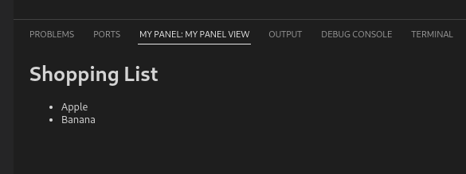

Represents a extension-contributed view that's displayed in the bottom or side bar:



#### Lookup
```typescript
import { WebviewView } from 'vscode-extension-tester';
...
// Focus the view using the command palette
await new Workbench().executeCommand('My Panel: Focus on My Panel View View');
// Create the Webview View object to access the Webview View
const webviewView = new WebviewView();
```

#### Switching Context
In order to access the elements inside the webview view frame, it is necessary to switch webdriver context into the frame. Analogically, to stop working with the webview view, switching back is necessary.
```typescript
// to switch inside the webview view frame, with optional customizable timeout
await webviewView.switchToFrame(5_000);

// to switch back to the default window
await webviewView.switchBack();
```

#### Searching for Elements Inside a Webview View
Make sure when searching for and manipulating with elements inside (or outside) the webview view that you have switched webdriver to the appropriate context. Also, be aware that referencing an element from the default window while switched to the webview view (and vice versa) will throw a `StaleElementReference` error.
```typescript
// first, switch inside the webview view
await webviewView.switchToFrame();

// look for desired elements
const element = await webviewView.findWebElement(<locator>);
const elements = await webviewView.findWebElements(<locator>);

...
// after all webview view manipulation is done, switch back to the default window
await webviewView.switchBack();
```